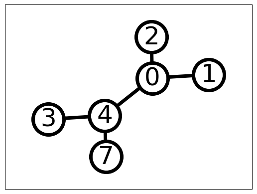

### Description
ThreadedGraphLib is a Python library that implements a few important graph functions and search algorithms. This repo aims at building a solid understanding for various search methods using first principles of graph theory available for any datascience aspirant. It uses graphs build using python library [networks](https://networkx.org/) for all input data.
 
### Algorithm roadmap 
- Graph colouring using independednt sets 
- Maximal Vertex Cover 
- Breadth First Search
- Depth First Search
- Handshaking Lemma

### Quick start

If you want to download the latest version from github for use or development purposes, make sure that you have git and the [anaconda distribution](https://www.anaconda.com/distribution/) installed and type the following:

```bash
git clone https://github.com/madkaikar-ashish/threadedgraphlib.git
cd threadedgraphlib
conda env create  # Automatically creates environment based on environment.yml
conda activate threadedgraphlib # Activate the environment
pip install -e . # Install editable local version
pytest # Ensure that the test cases are running
```

The above commands create a dedicated environment so that your anaconda configuration remains clean from the required dependencies installed.
To check that everything runs fine, you can build and run a test case by typing:

### Documentation
The documentation and the stable releases are available on in the main branch of this repo
: https://github.com/madkaikar-ashish/threadedgraphlib.git 
 
### Get involved
This project is an open-source project. Interested users are therefore invited to test, comment or [contribute](CONTRIBUTING.md) to the lirary. Submitting issues is the best way to get in touch with the development team, which will address your comment, question, or development request in the best possible way. We are also looking for contributors to the main code, willing to contibute to its capabilities, computational-efficiency, formulation, etc.

### License
The MIT License (MIT)
Copyright (c) [2023] [Ashish G Madkaikar]
Permission is hereby granted, free of charge, to any person obtaining a copy of this software and associated documentation files (the "Software"), to deal in the Software without restriction, including without limitation the rights to use, copy, modify, merge, publish, distribute, sublicense, and/or sell copies of the Software, and to permit persons to whom the Software is furnished to do so, subject to the following conditions:
The above copyright notice and this permission notice shall be included in all copies or substantial portions of the Software.
THE SOFTWARE IS PROVIDED "AS IS", WITHOUT WARRANTY OF ANY KIND, EXPRESS OR IMPLIED, INCLUDING BUT NOT LIMITED TO THE WARRANTIES OF MERCHANTABILITY, FITNESS FOR A PARTICULAR PURPOSE AND NONINFRINGEMENT. IN NO EVENT SHALL THE AUTHORS OR COPYRIGHT HOLDERS BE LIABLE FOR ANY CLAIM, DAMAGES OR OTHER LIABILITY, WHETHER IN AN ACTION OF CONTRACT, TORT OR OTHERWISE, ARISING FROM, OUT OF OR IN CONNECTION WITH THE SOFTWARE OR THE USE OR OTHER DEALINGS IN THE SOFTWARE.
To complete the MIT license information for your project "threadedgraphlib", you will need to insert the year of creation and the name of the copyright holder (usually, the project creator or creator's organization). Below is an example for the project "threadedgraphlib":
Copyright (c) [2023] [Ashish G Madkaikar]
Replace the sections in brackets with the appropriate information to adapt the license to your project.

### Main developers
Currently the main developers are the following:

- Ashish G Madkaikar (Pune, India)
